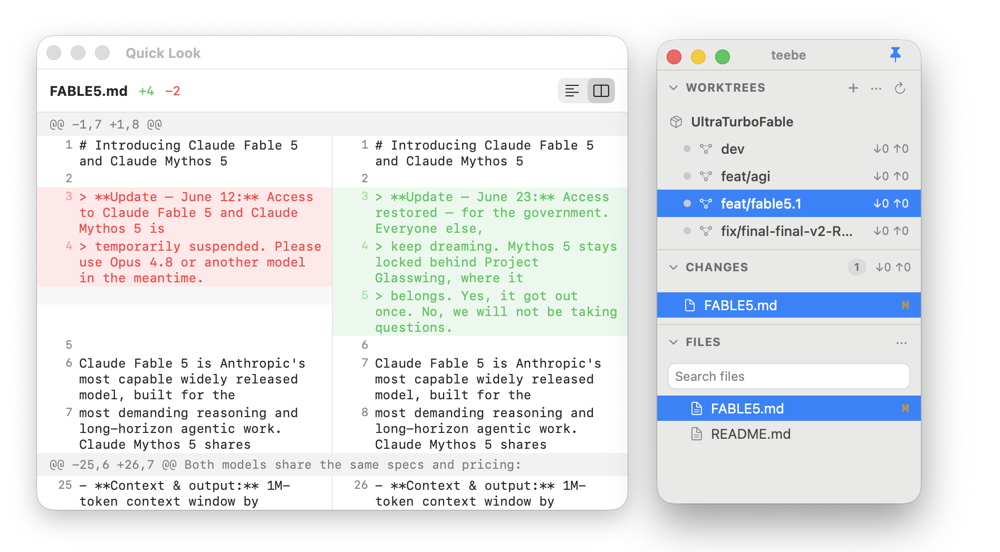
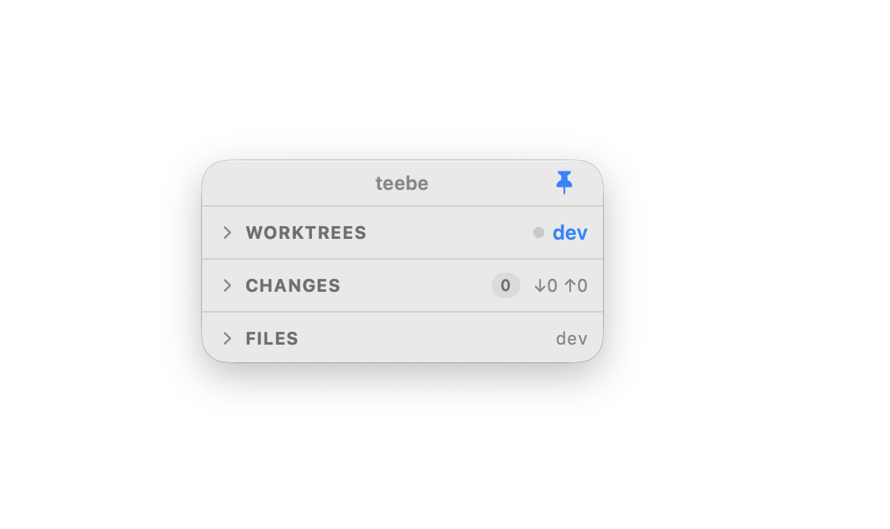
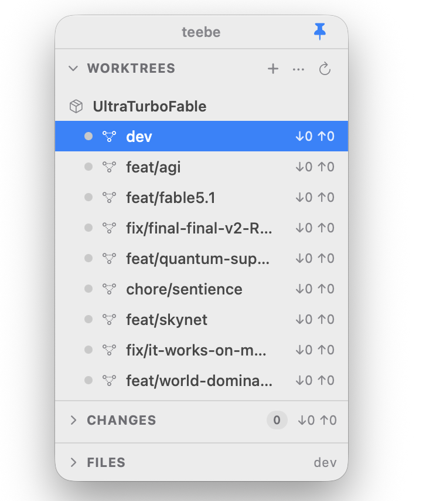

<p align="center">
  
</p>

# teebe

A native macOS file browser built for the multi-agent era.

When you have several AI coding agents (Claude Code, Codex/CMAX, etc.) working in
parallel across git worktrees, **teebe** is the calm control room that shows
you — across all your repos and worktrees — what files exist and what's changing.
It does not replace your editor: it's the navigator that launches files into
whatever native app you already use.

<p align="center">
  
</p>

> Status: in development. `TeebeCore` (git layer, parsers, services, file
> watcher, file ops, write queue) and the app's view models are implemented and
> tested; the SwiftUI shell is functional and wired (visual design in progress).

## Install

Download the latest `teebe.app` from the
[Releases](https://github.com/klein-t/teebe/releases) page, unzip it, and drag
it into `/Applications`. On first launch, right-click the app and choose **Open**
to get past Gatekeeper. The app keeps itself up to date via Sparkle.

## Uninstall

teebe is a self-contained `.app` with no installer, so removing it is just:

```sh
# 1. Quit teebe, then delete the app
rm -rf /Applications/teebe.app

# 2. Remove its saved state (added repos/worktrees, window layout)
rm -rf ~/Library/Application\ Support/teebe

# 3. Remove Sparkle's auto-update preferences and cache (optional)
defaults delete dev.teebe.app 2>/dev/null
rm -rf ~/Library/Caches/dev.teebe.app
```

teebe never touches your repositories themselves — uninstalling only removes the
app and its own state.

## Build & test

```sh
swift build           # builds TeebeCore + the Teebe app
swift test            # runs the Swift Testing suite (unit + git integration)
swift run Teebe  # launches the app
```

Requires macOS 14+ and a Swift 6 toolchain (built in Swift 5 language mode). Git
integration tests shell out to the system `git` against throwaway temp repos.

## Choosing a repository

teebe is multi-repo. There's no hardcoded path — it simply reopens whatever you
had selected last (state lives in
`~/Library/Application Support/teebe/state.json`).

- **Add a repo:** in the **WORKTREES** header, click **+**, or open the **···**
  menu → **Add Repository…**, then pick the repo folder.
- **Switch repos:** open the **···** menu and choose any repo you've added.
- **Remove the current repo:** **···** menu → **Remove _name_**.

If it keeps reopening the same repo, that's just the restored last selection —
add or switch to another and it'll remember that one next launch.

## Project layout

- `Sources/TeebeCore/` — pure, UI-independent core: models, `GitClient`
  (+ `ProcessGitClient`), porcelain/diff/worktree/branch parsers, services,
  `FileTreeBuilder`, `FSEventsWatcher`, file ops, `RepoGitQueue`.
- `Sources/Teebe/` — SwiftUI app: `@Observable` view models + thin views.
- `Tests/` — Swift Testing suites (`TeebeCoreTests`, `TeebeTests`),
  protocol fakes, and a `GitFixture` real-git harness.

## Why

There's no open-source, Finder-like, **worktree-aware** file browser.
Existing tools are either git clients centered on a single repo (Fork, Sublime
Merge), terminal TUIs (lazygit), or agent-session managers (Crystal, Conductor).
None give you a live, cross-worktree "mission control" of what your agents are
touching right now.

## What it is (v1)

- A **tree navigator**, not an editor. Click a file → it opens in its native app.
- **Worktree-aware**: pick any worktree of any repo and see its files.
- **Git-aware**: changed files are badged; a Changes view shows working changes
  with inline read-only diffs.
- **Live**: the tree and badges update in real time (FSEvents) as agents write.
- **Multi-repo**: add several repos; an Overview shows all worktrees at once.
- **Read-write** at the file-management level (rename/move/trash/new) and the git
  level (stage/discard/commit). Content editing is delegated to native apps.

<p align="center">
  
  &nbsp;&nbsp;
  
</p>

## What it is not (v1)

- Not a code editor (no in-app content editing).
- Not a full git client (no rebase / cherry-pick / merge-conflict UI).
- Not cross-platform (macOS only).
- Not an agent orchestrator (agent ↔ worktree mapping is a v2 integration).

## License

Teebe is **dual-licensed**:

- **GPL-3.0-or-later** for open-source use — see [`LICENSE`](LICENSE). You may use,
  modify, and redistribute it freely, but any distributed derivative must also be
  GPL with full source. You cannot build a closed-source product on top of it.
- **Commercial license** for embedding Teebe in a proprietary product without the
  GPL's obligations — available from the author.

See [`LICENSING.md`](LICENSING.md) for details and contact. Contributions are
accepted under the [Contributor License Agreement](CLA.md).
