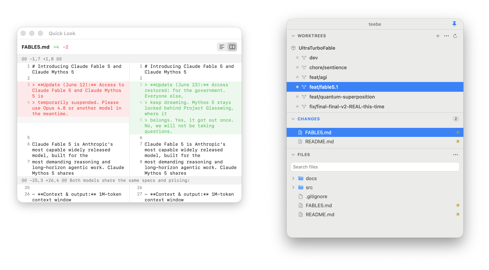

<p align="center">
  <a href="https://teebe.io"></a>
</p>

<h1 align="center">teebe</h1>

<p align="center"><strong>Git worktrees, without the IDE.</strong></p>

<p align="center">
  A native macOS git worktree GUI. Pick any worktree, including the ones Claude Code,<br>
  Codex and Cursor create for each session, and watch the files inside it, live,<br>
  as your agents edit them, with inline diffs right beside your terminal.
</p>

<p align="center">
  <a href="https://github.com/klein-t/teebe/releases/latest"></a>
  <a href="LICENSE"></a>
  
  
</p>

<p align="center">
  <a href="https://teebe.io">teebe.io</a> ·
  <a href="#install">Install</a> ·
  <a href="#what-it-does">What it does</a> ·
  <a href="#keyboard">Keyboard</a> ·
  <a href="CHANGELOG.md">Changelog</a>
</p>

<p align="center">
  <picture>
    <source media="(prefers-color-scheme: dark)" srcset="assets/teebe-dark.png">
    
  </picture>
</p>

## Install

```sh
curl -fsSL https://teebe.io/install.sh | bash
```

Or grab the latest build directly: [**teebe.zip**](https://dl.teebe.io) or
[**teebe.dmg**](https://dl.teebe.io/?kind=dmg) (both redirect to the current
[release](https://github.com/klein-t/teebe/releases)). Unzip it and drag it into
`/Applications`. If macOS asks on first launch, right-click the app and choose
**Open**. From then on teebe keeps itself up to date via Sparkle.

Free and open source · macOS 14 or newer · Apple Silicon and Intel.

## Why

Terminal agents are the fastest way to ship with AI. They are also a black box:
the agent says "done", and you are left tabbing between `git status` and your
editor to find out what "done" means across five worktrees.

teebe fixes exactly that, and nothing else. Point it at your worktrees and each
one gets a full file tree in a small native window beside your terminal: browse
what is inside every worktree, watch files light up as agents edit them, and
peek any diff with one keystroke. It does not run your agents, does not touch
your code, and does not replace your tools.

## What it does

- **Worktree-aware browsing.** Pick any worktree of any repo and explore its
  full file tree. Switch between trees instantly.
- **Live as your agents work.** Files badge and the tree updates the moment
  something changes on disk, so you watch edits land in real time.
- **Diffs, one keystroke away.** Select a changed file and press Space to peek
  its diff in a floating window, unified or side by side, without leaving teebe.
- **One CHANGES view.** Everything modified in the current worktree, gathered in
  a single list with ahead/behind counts for the branch.
- **Every repo at once.** Add multiple repos and see all their worktrees together.
- **Opens into your tools.** Press Return on a file and it launches in the native
  app you already use. teebe is the navigator; your editor stays the editor.
- **Claude-ready copies.** ⌘⇧C copies the selected files as `@`-refs, ready to
  paste into a Claude Code prompt.
- **Stays out of the way.** Pin the window on top, collapse any section, follow
  the system appearance or force light/dark, and let it idle at near-zero CPU
  when covered.

## What it is not

- Not a code editor: content editing happens in your native apps, not here.
- Not a full git client: no rebase, cherry-pick, or merge-conflict resolution.
- Not cross-platform: macOS only.
- Not an agent orchestrator: mapping agents to worktrees is a later integration.

## Keyboard

teebe is built to be driven without the mouse. The essentials:

| Keys | Action |
| --- | --- |
| `⌘1` `⌘2` `⌘3` | Focus WORKTREES / CHANGES / FILES (again to collapse) |
| `↑` `↓` | Move the selection in the active section |
| `←` `→` | Collapse / expand a folder |
| `Space` | Peek a change's diff, or Quick Look a file |
| `Return` | Open the file · switch to the worktree · open the change |
| `⌘F` | Jump to file search |
| `⌘⇧C` | Copy the selected files as `@`-refs |
| `⌘,` | Settings |

The full list lives in the app under **teebe → Keyboard Shortcuts**.

## Working with repositories

teebe is multi-repo and remembers whatever you had selected last.

- **Add a repo:** click **+** in the WORKTREES header, or open the **···** menu
  and choose **Add Repository…**, then pick the repo folder.
- **Switch repos:** open the **···** menu and choose any repo you have added.
- **Remove the current repo:** **···** menu → **Remove _name_**.

State lives in `~/Library/Application Support/teebe/state.json`. teebe never
writes into your repositories.

## Uninstall

teebe is a self-contained `.app` with no installer, so removing it is just:

```sh
# 1. Quit teebe, then delete the app
rm -rf /Applications/teebe.app

# 2. Remove its saved state (added repos/worktrees, window layout)
rm -rf ~/Library/Application\ Support/teebe

# 3. Remove Sparkle's auto-update preferences and cache (optional)
defaults delete dev.teebe.app 2>/dev/null
rm -rf ~/Library/Caches/dev.teebe.app
```

## Build from source

```sh
swift build           # builds TeebeCore + the Teebe app
swift test            # runs the Swift Testing suite (unit + git integration)
swift run Teebe       # launches the app
```

Requires macOS 14 or newer and a Swift 6 toolchain (built in Swift 5 language
mode). Git integration tests shell out to the system `git` against throwaway
temp repos. See [`CONTRIBUTING.md`](CONTRIBUTING.md) for the full setup.

### Project layout

- `Sources/TeebeCore/` is the pure, UI-independent core: models, `GitClient`
  (+ `ProcessGitClient`), porcelain/diff/worktree/branch parsers, services,
  `FileTreeBuilder`, `FSEventsWatcher`, file ops, `RepoGitQueue`.
- `Sources/Teebe/` is the SwiftUI app: `@Observable` view models and thin views.
- `Tests/` holds the Swift Testing suites (`TeebeCoreTests`, `TeebeTests`),
  protocol fakes, and a `GitFixture` real-git harness.

## Why it exists

There is no open-source, Finder-like, **worktree-aware** file browser. Existing
tools are either git clients centered on a single repo (Fork, Sublime Merge),
terminal TUIs (lazygit), or agent-session managers (Crystal, Conductor). None
give you a live, cross-worktree "mission control" of what your agents are
touching right now.

## License

teebe is **dual-licensed**:

- **GPL-3.0-or-later** for open-source use; see [`LICENSE`](LICENSE). You may use,
  modify, and redistribute it freely, but any distributed derivative must also be
  GPL with full source. You cannot build a closed-source product on top of it.
- **Commercial license** for embedding teebe in a proprietary product without the
  GPL's obligations, available from the author.

See [`LICENSING.md`](LICENSING.md) for details and contact. Contributions are
accepted under the [Contributor License Agreement](CLA.md).
