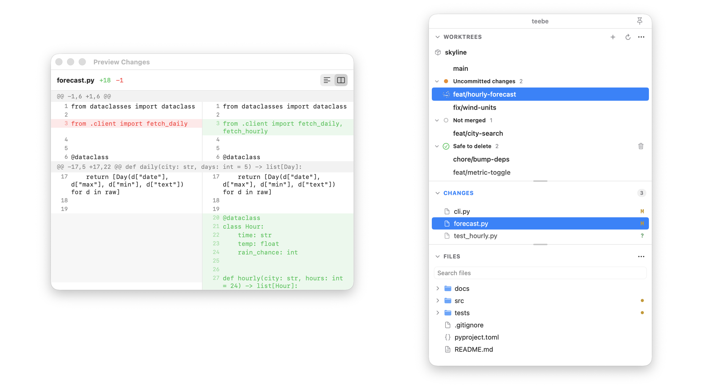

<p align="center">
  <a href="https://teebe.io"></a>
</p>

<h1 align="center">teebe</h1>

<p align="center"><strong>Git worktrees, without the IDE.</strong></p>

<p align="center">
  An open-source macOS app to see all git worktrees across all your repos in one window.<br>
  See which Claude Code, Codex and Cursor agents are working in each worktree and what<br>
  they are changing, live. Built for running several AI coding agents in parallel.
</p>

<p align="center">
  <a href="https://github.com/klein-t/teebe/releases/latest"></a>
  <a href="LICENSE"></a>
  
  
</p>

<p align="center">
  <a href="https://teebe.io">teebe.io</a> ·
  <a href="#install">Install</a> ·
  <a href="#what-it-does">What it does</a> ·
  <a href="#keyboard">Keyboard</a> ·
  <a href="CHANGELOG.md">Changelog</a>
</p>

<p align="center">
  <picture>
    <source media="(prefers-color-scheme: dark)" srcset="assets/teebe-dark.png">
    
  </picture>
</p>

## Install

```sh
brew install --cask klein-t/tap/teebe
```

Or use the install script:

```sh
curl -fsSL https://teebe.io/install.sh | bash
```

Or grab the latest build directly: [**teebe.zip**](https://dl.teebe.io) or
[**teebe.dmg**](https://dl.teebe.io/?kind=dmg) (both redirect to the current
[release](https://github.com/klein-t/teebe/releases)). Unzip it and drag it into
`/Applications`. teebe is not notarized yet, so macOS may block the first launch of
a downloaded copy: on macOS 15 or newer, open **System Settings → Privacy & Security**
and click **Open Anyway**; on macOS 14, right-click the app and choose **Open**. The
Homebrew cask and the install script skip this step. From then on teebe keeps itself
up to date via Sparkle.

Free and open source · macOS 14 or newer · Apple Silicon.

## Why

Terminal agents are the fastest way to ship with AI, and also a black box: the
agent says "done" and you are left running `git status` across five worktrees to
find out what that means. Managing those worktrees usually means memorising
`git worktree` commands or opening a full IDE just to look at a branch.

teebe is a small native window that sits beside your terminal and shows every
worktree of every repo, which ones have an agent in them, what each one changed,
and which are merged and safe to remove. Git clients like Fork or Sublime Merge
center on one repo, lazygit lives in the terminal, and agent managers like
Conductor run the agents for you. teebe only watches.

## What it does

- **Every worktree, every repo.** All worktrees of all your repos in one list,
  each with a full file tree you can browse.
- **Status at a glance.** One mark per worktree: an agent working, uncommitted
  changes, commits not merged yet, or merged and safe to delete. Group and sort
  the list by status.
- **Agent activity.** See when Claude Code or Codex is working or waiting in a
  worktree, with optional notifications when a turn finishes. Files badge live
  as any agent or tool edits them.
- **Merge detection that understands squash merges.** Worktrees are checked
  against your default and integration branches, and a background fetch keeps
  it current.
- **Cleanup in one step.** Remove one worktree, or every one that is safe to
  delete, after a confirmation that lists them. Commits only that worktree
  still reached are kept in a hidden backup.
- **New worktrees without the commands.** Create one on a new or existing
  branch, from any starting point, in a folder teebe suggests.
- **Diffs, one keystroke away.** Press Space on a change to peek its diff,
  unified or side by side. Return opens a file in the app you already use, and
  ⌘⇧C copies files as `@`-refs for an agent prompt.

## What it is not

- Not an agent runner or orchestrator: it does not start or steer agents, it
  watches them.
- Not a code editor: editing happens in your own apps.
- Not a full git client: no rebase, cherry-pick, or conflict resolution.
- Not cross-platform: macOS only.

How it compares with other worktree tools:
[teebe.io/compare/git-worktree-gui-mac](https://teebe.io/compare/git-worktree-gui-mac/).

## Keyboard

teebe is built to be driven without the mouse. The essentials:

| Keys | Action |
| --- | --- |
| `⌘1` `⌘2` `⌘3` | Focus WORKTREES / CHANGES / FILES (again to collapse) |
| `↑` `↓` | Move the selection in the active section |
| `←` `→` | Collapse / expand a folder |
| `Space` | Peek a change's diff, or Quick Look a file |
| `Return` | Open the file · switch to the worktree · open the change |
| `⌘F` | Jump to file search |
| `⌘⇧C` | Copy the selected files as `@`-refs |
| `⌘,` | Settings |

The full list lives in the app under **teebe → Keyboard Shortcuts**.

## Working with repositories

teebe is multi-repo and remembers whatever you had selected last.

- **Add a repo:** open the **···** menu in the WORKTREES header, choose
  **Add Repository…**, then pick the repo folder.
- **New worktree:** click **+** in the WORKTREES header.
- **Switch repos:** open the **···** menu and choose any repo you have added.
- **Remove the current repo:** **···** menu → **Remove _name_**.

State lives in `~/Library/Application Support/teebe/state.json`. teebe never
writes into your repositories.

## Uninstall

teebe is a self-contained `.app` with no installer, so removing it is just:

```sh
# 1. Quit teebe, then delete the app
rm -rf /Applications/teebe.app

# 2. Remove its saved state (added repos/worktrees, window layout)
rm -rf ~/Library/Application\ Support/teebe

# 3. Remove Sparkle's auto-update preferences and cache (optional)
defaults delete dev.teebe.app 2>/dev/null
rm -rf ~/Library/Caches/dev.teebe.app
```

## Build from source

```sh
swift build           # builds TeebeCore + the Teebe app
swift test            # runs the Swift Testing suite (unit + git integration)
swift run Teebe       # launches the app
```

Requires macOS 14 or newer and a Swift 6 toolchain (built in Swift 5 language
mode). Git integration tests shell out to the system `git` against throwaway
temp repos. See [`CONTRIBUTING.md`](CONTRIBUTING.md) for the full setup.

### Project layout

- `Sources/TeebeCore/` is the pure, UI-independent core: models, `GitClient`
  (+ `ProcessGitClient`), porcelain/diff/worktree/branch parsers, services,
  `FileTreeBuilder`, `FSEventsWatcher`, file ops, `RepoGitQueue`.
- `Sources/Teebe/` is the SwiftUI app: `@Observable` view models and thin views.
- `Tests/` holds the Swift Testing suites (`TeebeCoreTests`, `TeebeTests`),
  protocol fakes, and a `GitFixture` real-git harness.

## License

teebe is **dual-licensed**:

- **GPL-3.0-or-later** for open-source use; see [`LICENSE`](LICENSE). You may use,
  modify, and redistribute it freely, but any distributed derivative must also be
  GPL with full source. You cannot build a closed-source product on top of it.
- **Commercial license** for embedding teebe in a proprietary product without the
  GPL's obligations, available from the author.

See [`LICENSING.md`](LICENSING.md) for details and contact. Contributions are
accepted under the [Contributor License Agreement](CLA.md).

Listed in [awesome-mac](https://github.com/jaywcjlove/awesome-mac#version-control).
